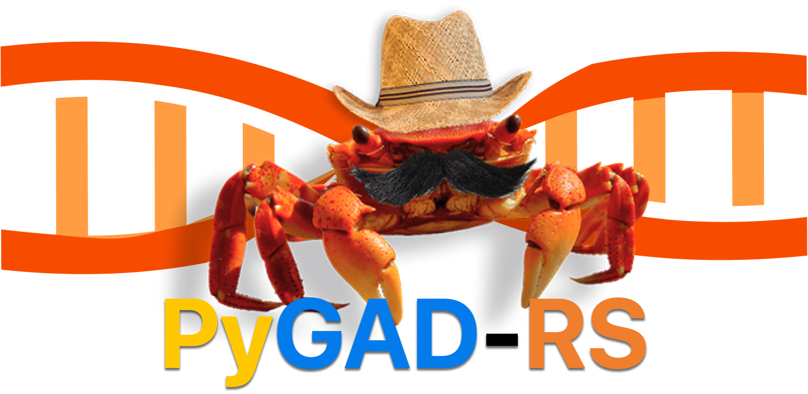

# PyGAD: Genetic Algorithm for Python written in Rust

[PyGAD](https://pypi.org/project/pygad) is an open-source easy-to-use Python 3 library for building the genetic algorithm and optimizing machine learning algorithms. It supports Keras and PyTorch.

It's a fork of PyGAD written in Rust to be ⚡️🚀 BLAZINGLY FAST ⚡️🚀

Check the documentation of the [PyGAD](https://pygad.readthedocs.io/en/latest).

